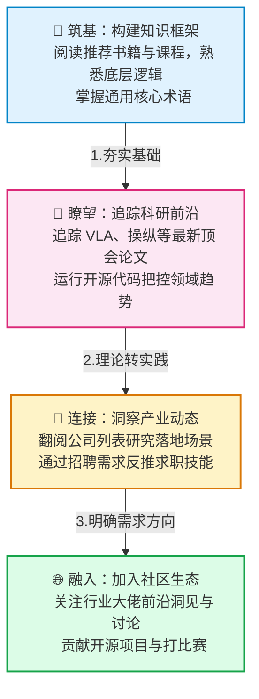

# 🤖星期八-具身智能资源库

## 🌟 我们的愿景
> 一份持续更新的具身智能（Embodied AI）领域结构化资源索引，涵盖公司、招聘、论文、代码库、数据集、学习路径等。旨在**降低中文开发者的信息检索门槛，共建行业知识地图**。

**“星期八”意味着额外的一天——我们希望具身智能技术的普及能极大解放生产力，用最高效的技术让你的生活真正“多出一天”。**

这里不是又一个冗杂的论文列表，而是一个连接**产业、人才与知识**的信息枢纽。不论你是学生、工程师还是投资人，都能在这里找到所需的拼图。

🌐 [English Version](README_EN.md)

---

## 📚 1. 核心资源矩阵

本仓库的设计理念是**按图索骥，各取所需**，拒绝杂乱的文章堆砌。你可以通过下方的网格导航迅速找到所需的板块：

| 🧠 基础建设 | 🏢 产业动态 | 🛠️ 技术生态 |
| :--- | :--- | :--- |
| [**📖 基础知识**](00-basics.md) 入门书籍、课程路线与核心术语 | [**🏢 具身智能公司**](01-companies.md) 行业图谱与代表企业及产品 | [**📄 论文与代码库**](03-papers-code.md) 涵盖9大方向的前沿顶会与代码 |
| [**🤝 贡献指南**](CONTRIBUTING.md) 欢迎以 PR 的形式参与共建知识库 | [**💼 招聘信息**](02-jobs.md) 最新 HC 、实习机会与行业人才需求 | [**🔧 工具与平台**](04-tools.md) 数据处理、控制开发与仿真评测工具 |

*(注：学习交流社区体系正在筹备建设中，相关资源后续将补充，如有推荐欢迎通过 Issues 或者下方公众号联系我们！)*

---

## 🧭 2. 学习路径图 (From Zero to Hero)

> **给初学者的一份学习导航：顺着图表层层深入具身生态**

---

## 🤝 3. 如何贡献

> 💡 **资源的价值在于使用，更在于分享**。如果你通过这份资源库有所收获，不妨也贡献一份力量，帮助后来者走得更顺！

我们欢迎所有形式的贡献（如添加公司、优质论文、工具等）：

1. 📖 阅读 [贡献指南](CONTRIBUTING.md) 了解详细流程。
2. ✨ 提交 [Pull Request](https://github.com/AlexZhangUPUPUP/octoday-robotics/compare) 直接贡献资源更新。
3. 🐛 发现死链、错误或有新建议？请提交 [Issue](https://github.com/AlexZhangUPUPUP/octoday-robotics/issues/new/choose)。

---

## 👥 关于星期八团队

**星期八 Robotics（Octoday-Robotics）** 是一个由具身智能爱好者、开发者和行业观察者组成的开放社区。我们希望通过系统化的资源整理，降低中文开发者进入具身智能领域的门槛，加速知识传播与产业融合。

项目完全开源，欢迎任何形式的贡献、建议与合作。如果您有任何问题、想法或资源推荐，欢迎通过以下方式联系我们：

- **邮箱**：octoday@yeah.net
- **GitHub Issues**：直接提交 [Issue](https://github.com/AlexZhangUPUPUP/octoday-robotics/issues)
- 📱 **微信公众号**：扫描下方二维码，获取最新动态与资源更新

### 🌟 特别感谢

感谢所有为项目添砖加瓦的贡献者（排名不分先后）：

---

## 📄 许可证

本项目采用 MIT 许可证。详细信息请查看 [LICENSE](LICENSE) 文件。
