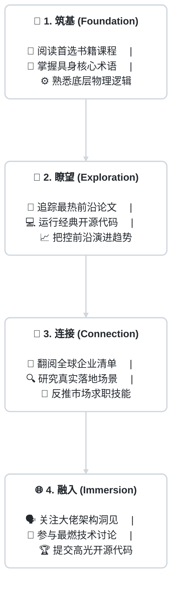

  
  
  
&nbsp;

  
  
  
  
&nbsp;

  
  

    &emsp;
    &emsp;
    
  

  
  
&nbsp;

<h2 align="center"> 我们的愿景 (Vision)</h2>

<b>星期八 (Octoday)</b> 意味着额外的一天——我们希望具身智能技术的普及能极大解放生产力，用最高效的技术让你的生活真正“多出一天”。

这里不仅是一份持续更新的结构化资源库（涵盖公司、招聘、论文、代码库、数据集），更是一个连接<b>产业</b>、<b>人才</b>与<b>知识</b>的信息枢纽。我们汇聚了一群有开源信仰的探索者，无论你是渴望入局的小白、资深算法工程师，还是产业投资人，都能在这里找到属于你的这块拼图。

 

<h2 align="center"> 核心航向标 (Guide)</h2>

拒绝杂乱的文章堆砌，采用<b>问题导向</b>的高效导航。遇到什么路障，就点什么板块 👇

<table align="center" width="100%">
  <tr>
    <td align="center" width="55%">
      
      <b>想从零开始打捞知识底座？</b>
    </td>
    <td align="center" width="45%">
      
前往 <a target="_blank" href="00-basics.md"><b>📖《基础知识与入门库》</b></a>

    </td>
  </tr>
  <tr>
    <td align="center">
      
      <b>需要追踪国际顶会与最热代码？</b>
    </td>
    <td align="center">
      
前往 <a target="_blank" href="03-papers-code.md"><b>📄《前沿论文与开源代码》</b></a>

    </td>
  </tr>
  <tr>
    <td align="center">
      
      <b>寻找好用的机器人仿真开发工具？</b>
    </td>
    <td align="center">
      
前往 <a target="_blank" href="04-tools.md"><b>🔧《工具与仿真平台》</b></a>

    </td>
  </tr>
  <tr>
    <td align="center">
      
      <b>想洞察全行业正在落地的明星公司？</b>
    </td>
    <td align="center">
      
前往 <a target="_blank" href="01-companies.md"><b>🏢《具身智能全球图谱》</b></a>

    </td>
  </tr>
  <tr>
    <td align="center">
      
      <b>准备看机会、求职投递简历？</b>
    </td>
    <td align="center">
      
前往 <a target="_blank" href="02-jobs.md"><b>💼《最新HC与招聘内推》</b></a>

    </td>
  </tr>
</table>

 

<h2 align="center"> 进阶演练舱 (From Zero to Hero)</h2>

顺着极简学习主轴层层深入具身生态结构：

 

<h2 align="center"> 参与共建 (How to Contribute)</h2>

<table align="center" width="100%">
  <tr>
    <td align="center" width="55%">
      
      <b>想提交你的公司、论文或新工具？</b>
    </td>
    <td align="center" width="45%">
      
请参考：<a target="_blank" href="CONTRIBUTING.md"><b>🤝《开源贡献指南 PR Flow》</b></a>

    </td>
  </tr>
  <tr>
    <td align="center">
      
      <b>发现死链、错误，提出前沿建议？</b>
    </td>
    <td align="center">
      
一键开启：<a target="_blank" href="https://github.com/AlexZhangUPUPUP/octoday-robotics/issues/new/choose"><b>🐛 提交 Issues</b></a>

    </td>
  </tr>
</table>

 

<h2 align="center"> 加入社区 (Community)</h2>

项目完全开源，扫描下方图片二维码加入组织，获取最新动态与资源更新，获取属于你的第八天：

  

 

<h2 align="center"> 星光贡献榜 (Contributors)</h2>

  
致谢所有在这片智能土地上开荒撒网的技术先锋：

  

 

  <small>开源的魅力在于不受拘束，本项目采用极度宽松的 <a href="LICENSE">MIT License</a>。</small>

