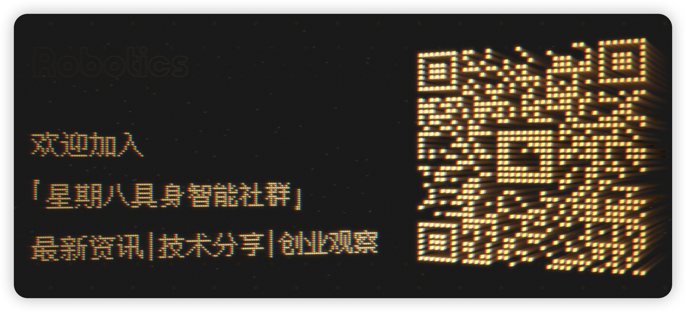

  

  
&nbsp;

  

  
&nbsp;

  

    &emsp;
    &emsp;
    &emsp;
    
  

  
&nbsp;

## 项目定位

`Octoday Robotics` 现在不再只是 5 篇长文的资源堆叠，而是开始向一套更适合 GitHub 浏览与持续扩展的 `Embodied AI Hub` 结构演进。

这次重构的目标不是推倒重来，而是把你已经沉淀下来的高价值内容，映射到更清晰的目录化信息架构里。

## 这次重构后的阅读方式

| 你现在想解决什么问题 | 推荐入口 | 说明 |
| --- | --- | --- |
| 我刚接触具身智能，不知道从哪里开始 | [Learning 学习中心](embodied-ai-hub/learning/README.md) | 书单、课程、术语、学习路径 |
| 我想按角色或任务快速找到资料 | [Navigation 导航中心](embodied-ai-hub/navigation/README.md) | 按新人、研究者、求职者、开发者拆路由 |
| 我想看代表公司和产业格局 | [Companies 公司库](embodied-ai-hub/companies/README.md) | 国内外重点公司、观察维度、行业标签 |
| 我想找岗位和能力要求 | [Jobs 岗位中心](embodied-ai-hub/jobs/README.md) | 岗位类型、技能关键词、投递建议 |
| 我想追论文、项目和模型路线 | [Papers 论文索引](embodied-ai-hub/papers/README.md) | Foundation Models、VLA、Agent、Manipulation、Navigation |
| 我想找可复现的代码与工具链 | [Projects 项目与工具](embodied-ai-hub/projects/README.md) | 仿真平台、训练框架、开发工具、开源基座 |
| 我想找数据集、基准和评测集 | [Datasets 数据与基准](embodied-ai-hub/datasets/README.md) | 数据集地图、Benchmark、评测建议 |
| 我想跟进行业趋势与重点方向 | [Trends 趋势雷达](embodied-ai-hub/trends/README.md) | 顶会、实验室、赛道、观察框架 |
| 我想做周更/资讯整理 | [Weekly 周报模板](embodied-ai-hub/weekly/README.md) | 可直接扩展成每周更新机制 |

## 新的 Hub 结构

| 模块 | 作用 | 主入口 | 对应旧内容来源 |
| --- | --- | --- | --- |
| `navigation` | 按角色和问题快速导航 | [进入](embodied-ai-hub/navigation/README.md) | 融合全仓库 |
| `learning` | 基础知识与学习路径 | [进入](embodied-ai-hub/learning/README.md) | [`00-basics.md`](00-basics.md) |
| `companies` | 公司、产品与产业图谱 | [进入](embodied-ai-hub/companies/README.md) | [`01-companies.md`](01-companies.md) |
| `jobs` | 招聘、技能画像、投递建议 | [进入](embodied-ai-hub/jobs/README.md) | [`02-jobs.md`](02-jobs.md) |
| `papers` | 论文主索引与专题子页 | [进入](embodied-ai-hub/papers/README.md) | [`03-papers-code.md`](03-papers-code.md) |
| `projects` | 开源项目、平台、仿真与工具链 | [进入](embodied-ai-hub/projects/README.md) | [`03-papers-code.md`](03-papers-code.md), [`04-tools.md`](04-tools.md) |
| `datasets` | 数据集、基准、评测 | [进入](embodied-ai-hub/datasets/README.md) | [`03-papers-code.md`](03-papers-code.md) |
| `trends` | 趋势追踪与研究观察框架 | [进入](embodied-ai-hub/trends/README.md) | 融合论文/公司/岗位/会议 |
| `weekly` | 周报化沉淀与自动化更新入口 | [进入](embodied-ai-hub/weekly/README.md) | `embodied-ai-hub/scripts/` |

## 融合策略

> 这次不是把旧内容直接删掉，而是做了一个双层结构：
>
> 1. 根目录保留原有长文，作为全量信息源。
> 2. `embodied-ai-hub/` 提供更适合 GitHub 展示的目录式导航与专题入口。
> 3. 后续如果你要继续重构，可以再把旧长文逐步拆成更细的专题页，而不会破坏当前链接体系。

## 旧内容归档

如果你仍然习惯一次性阅读完整长文，这些旧入口仍然保留：

| Legacy 文档 | 内容 |
| --- | --- |
| [`00-basics.md`](00-basics.md) | 基础知识、书单、课程、术语、学习路径 |
| [`01-companies.md`](01-companies.md) | 国内外具身智能公司全量长表 |
| [`02-jobs.md`](02-jobs.md) | 招聘信息、岗位亮点、求职建议 |
| [`03-papers-code.md`](03-papers-code.md) | 论文、代码、数据集、基准、综述 |
| [`04-tools.md`](04-tools.md) | 仿真平台、开发框架、SDK、硬件平台 |

## 参与共建

如果你想继续把这个仓库打造成长期可维护的具身智能信息枢纽，最值得持续做的是：

- 把 `weekly/` 变成真实周报，固定每周沉淀一版行业脉络。
- 把 `papers/`、`datasets/`、`projects/` 按专题继续拆页，减少单页过长。
- 给 `companies/` 增加更细的标签维度，比如 `人形`、`灵巧操作`、`工业物流`、`家庭服务`、`核心部件`。
- 把 `jobs/` 做成“能力画像”驱动，而不仅仅是岗位列表。

提交方式见 [CONTRIBUTING.md](CONTRIBUTING.md)。

## 社区与致谢

  

  <small>本项目采用 <a href="LICENSE">MIT License</a>，欢迎围绕具身智能知识、产业、工具与人才生态继续共建。</small>

