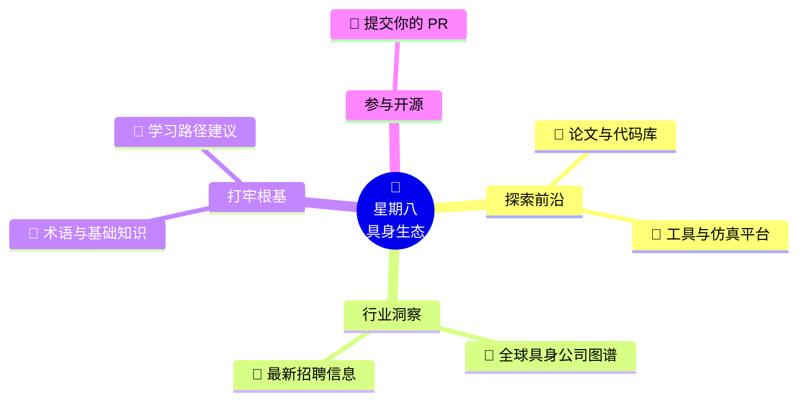

<div align="center">


<br/>

<a href="README_EN.md">
  
</a>

<br/><br/>

# 🤖 星期八 · 具身智能资源库
**— 降低检索门槛 · 共建产业级知识地图 —**

[](https://github.com/AlexZhangUPUPUP/octoday-robotics/stargazers)
[](https://github.com/AlexZhangUPUPUP/octoday-robotics)
[](CONTRIBUTING.md)

</div>

<br/>

## 🗺️ 全局知识生态 (Knowledge Map)

> 💡 **“星期八”**意味着额外的一天，我们希望这些优质结构化的资源整理，能极大解放开发者的获取成本，让最高效的技术使你的生活真正**多出一天**。  
> 这里不是又一个冗杂的论文列表，而是一个连接**产业、人才与知识**的高频能量站。



---

## 🎯 核心航站楼 (Core Terminals)

本仓库采用**按图索骥 (On-demand)** 的设计理念。拒绝文章堆砌，通过下方操作面板直接一键直达所需功能区。

<div align="center">
  <table>
    <tr>
      <td align="center" width="33%">
        <b>🧠 基础底层</b><br>
        <sub>理论与逻辑</sub><br><br>
        <a href="00-basics.md">
          
        </a><br><br>
        <a href="CONTRIBUTING.md">
          
        </a>
      </td>
      <td align="center" width="33%">
        <b>🏢 产业风向</b><br>
        <sub>场景与机遇</sub><br><br>
        <a href="01-companies.md">
          
        </a><br><br>
        <a href="02-jobs.md">
          
        </a>
      </td>
      <td align="center" width="33%">
        <b>🛠️ 技术生态</b><br>
        <sub>算法与评测</sub><br><br>
        <a href="03-papers-code.md">
          
        </a><br><br>
        <a href="04-tools.md">
          
        </a>
      </td>
    </tr>
  </table>
</div>
<div align="center">
  <sub>*(注：交流社区体系正在筹备建设中，相关资源后续将补充，如有推荐欢迎通过 Issues 或者下方公众号联系我们！)*</sub>
</div>

---

## 🧭 进阶演练舱 (From Zero to Hero)

> 以下是一套专为初学者打造的破冰路线。**流程图统领大局 + 折叠面板细化任务**，让你看完图表，立刻就能行动跳转。

```mermaid
flowchart LR
    %% 自定义节点样式
    classDef base fill:#E1F5FE,stroke:#0284c7,stroke-width:2px,color:#0369a1,rx:5,ry:5;
    classDef explore fill:#FCE4EC,stroke:#db2777,stroke-width:2px,color:#be185d,rx:5,ry:5;
    classDef connect fill:#FFF8E1,stroke:#d97706,stroke-width:2px,color:#b45309,rx:5,ry:5;
    classDef community fill:#E8F5E9,stroke:#16a34a,stroke-width:2px,color:#15803d,rx:5,ry:5;

    %% 节点定义
    A["<b>🧱 1. 筑基：构建知识框架</b><br/>━━━━━━━━━━━━━<br/>📖 阅读推荐书籍与课程<br/>⚙️ 熟悉基础底层逻辑<br/>🧠 掌握通用核心术语"]:::base
    
    B["<b>🔭 2. 瞭望：追踪科研前沿</b><br/>━━━━━━━━━━━━━<br/>📄 追踪前沿顶会论文<br/>💻 运行复现开源代码<br/>📈 把控最新领域趋势"]:::explore
    
    C["<b>🧩 3. 连接：洞察产业动态</b><br/>━━━━━━━━━━━━━<br/>🏢 翻阅公司产品列表<br/>🔍 研究实际落地场景<br/>💼 反推求职所需技能"]:::connect
    
    D["<b>🌐 4. 融入：加入社区生态</b><br/>━━━━━━━━━━━━━<br/>🗣️ 关注行业大佬洞见<br/>💬 参与优质技术讨论<br/>🏆 贡献开源或打比赛"]:::community

    %% 阶段流转线
    A ====>|"第一阶段"| B
    B ====>|"第二阶段"| C
    C ====>|"第三阶段"| D

    %% 连接线样式
    linkStyle default stroke:#94a3b8,stroke-width:2px,color:#475569;
```

### ⚡ 行动清单 (Action Checklist)
*点击下方展开详细要求，直达资源目标页！*

<details open>
<summary><b>🔥 Phase 1: 强打底盘 (Foundation)</b></summary>
<br>

> 📚 推荐直接点击访问 [**📖 基础知识板块**](00-basics.md) 开始你的第一站：
> 1. 阅读推荐的入门书籍与经典视频课程，对具身架构建立直观体感。
> 2. 背熟各种核心概念（如 VLA、阻抗控制、正逆运动学），这是高效阅读前沿论文的密码。

</details>

<details>
<summary><b>🔥 Phase 2: 追踪火力 (Exploration)</b></summary>
<br>

> 🔬 前往 [**📄 论文与代码库**](03-papers-code.md) 以及 [**🔧 工具与平台**](04-tools.md)：
> 1. 关注国际顶会（CoRL, ICRA, IROS）的最新操作榜单与视觉架构前沿。
> 2. 本地跑通一两个强化学习或模仿学习的经典开源框架以深挖系统底座。

</details>

<details>
<summary><b>🔥 Phase 3: 直面商海 (Industry)</b></summary>
<br>

> 🏢 务实是最后的技术归宿，请深入探索 [**🏢 具身智能公司动态**](01-companies.md)：
> 1. 拆解这几十家头部明星公司到底在用什么方案，旨在落地在何种场景。
> 2. 从 [**💼 招聘信息专区**](02-jobs.md) 分析市场对具身智能工程师的具体 HC 技能要求，反推出你的“技能树碎片”。

</details>

<details>
<summary><b>🔥 Phase 4: 开源共建 (Community)</b></summary>
<br>

> 🏆 沉淀与分享是极客最好的名片，详见 [**🤝 贡献指南**](CONTRIBUTING.md)：
> 1. 参加业内开源生态活动，亦或各种软硬件控制挑战赛。
> 2. 为本资源库以及你熟知的其他具身项目提交 Issue 洞见，合并属于你的第一行 PR。

</details>

---

## 🤝 如何参与 (How to Contribute)

> 💡 **“知识的裂变，来自分享。”** 
> 
> 如果这份指南降低了你的上手难度，不妨也提交一个提交 PR 补全它，帮助后来者走得更顺！

我们非常欢迎所有形式的微小贡献（添加你的公司、优质论文、甚至修正错别字）。仅需几步愉快的流程即可完成交互：

1. 📖 阅读 [贡献指南](CONTRIBUTING.md) 了解基础规范。
2. ✨ 在 GitHub 提交 [Pull Request](https://github.com/AlexZhangUPUPUP/octoday-robotics/compare) 直接挂载资源。
3. 🐛 发现死链、错误或有产品新建议？请一键提交 [Issue 新方案](https://github.com/AlexZhangUPUPUP/octoday-robotics/issues/new/choose)。

---

## 👥 关于星期八团队 (About Us)

**星期八 Robotics（Octoday-Robotics）** 是一个无边界的具身智能爱好者联盟。在这里，算法工程师、硬件极客、产业观察者共同协作，试图消除进入机器人领域的高精尖“技术壁垒”。

本项目依靠纯开源生态自我更迭。如有任何学术碰撞、合作灵感，请随时呼叫中心：

- 📧 **邮箱**：octoday@yeah.net
- 📝 **脑洞与追踪**：[开启一个全新的 Issue](https://github.com/AlexZhangUPUPUP/octoday-robotics/issues)
- 📱 **官方微信矩阵**：扫描下方二维码，共同进击下一个时代。

<div align="center">
  
</div>

### 🌟 星光贡献榜 (Hall of Contributors)

致谢所有在这片智能土地上开荒撒网的技术先锋：

<a href="https://github.com/AlexZhangUPUPUP/octoday-robotics/graphs/contributors">
  
</a>

---

## 📄 许可证 (License)

开源的魅力在于不受拘束，本项目采用高度宽容的 MIT License。详细条款请审阅 [LICENSE](LICENSE) 自治协议。
