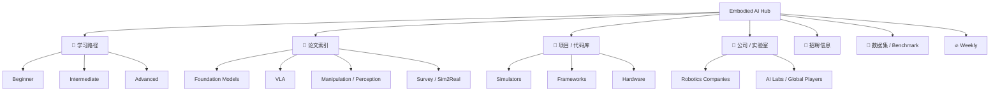

  

  
&nbsp;

  

  
&nbsp;

  

    &emsp;
    &emsp;
    &emsp;
    
  

# 🤖 星期八 · 具身智能资源库 (Embodied AI Hub)

> 🚀 一个连接「论文 × 项目 × 公司 × 人才」的具身智能信息枢纽
> Built for developers, researchers, and builders in Embodied AI

---

## 🔥 本周精选（Weekly Picks）

> 每周更新，帮你节省信息筛选时间

| 模块 | 本周焦点 | 入口 |
| --- | --- | --- |
| 🧠 Papers | ⭐ Must Read: [Robot Foundation Models](embodied-ai-hub/papers/foundation-models.md) 🔥 Trending: [VLA (Vision-Language-Action)](embodied-ai-hub/papers/vla.md) | [论文总索引](embodied-ai-hub/papers/README.md) |
| 🤖 Projects | 🔥 [Open-source Robot Stack](embodied-ai-hub/projects/frameworks.md) 🧠 [Simulation → Real Transfer Toolchains](embodied-ai-hub/papers/sim2real.md) | [项目入口](embodied-ai-hub/projects/README.md) |
| 📈 Trends | [VLA 正在成为统一范式](embodied-ai-hub/trends/README.md) [仿真到现实的迁移加速](embodied-ai-hub/papers/sim2real.md) | [趋势雷达](embodied-ai-hub/trends/README.md) |

👉 [点击进入 Weekly 全列表](embodied-ai-hub/weekly/README.md)

---

## 📊 论文排行榜（Paper Radar）

> 不是简单按热度堆砌，而是按“当前最值得投入时间”的主题排序

| Rank | Topic | 为什么值得先看 | 入口 |
| --- | --- | --- | --- |
| 🥇 01 | Robot Foundation Models | 正在重新定义通用机器人能力的上限和数据组织方式 | [foundation-models.md](embodied-ai-hub/papers/foundation-models.md) |
| 🥈 02 | VLA (Vision-Language-Action) | 当前最强的统一范式之一，连接感知、语言和动作 | [vla.md](embodied-ai-hub/papers/vla.md) |
| 🥉 03 | Manipulation | 最接近真实机器人落地的研究主线之一 | [manipulation.md](embodied-ai-hub/papers/manipulation.md) |
| 04 | Embodied Agents & Reasoning | 长时程任务、规划和 agentic pipeline 的核心入口 | [agents.md](embodied-ai-hub/papers/agents.md) |
| 05 | Sim2Real | 从“论文能跑”走向“系统能落地”的关键桥梁 | [sim2real.md](embodied-ai-hub/papers/sim2real.md) |

---

## ⚡ 每周最新资讯（Latest Signals）

> 让用户不用先翻完整目录，也能快速感知这一周该看什么

| Channel | Latest Focus | Link |
| --- | --- | --- |
| Weekly Digest | 本周聚焦 `VLA / 操作数据 / 仿真平台` 三条线 | [Week 01 Sample](embodied-ai-hub/weekly/2026/week-01.md) |
| Papers | 从 `Foundation Models` 和 `VLA` 两条线切入，建立主干认知 | [Paper Library](embodied-ai-hub/papers/README.md) |
| Projects | 推荐优先看 `Frameworks` 和 `Simulators`，最容易进入工程闭环 | [Projects](embodied-ai-hub/projects/README.md) |
| Jobs | 招聘高频关键词仍然集中在 `VLA / 仿真 / 控制 / ROS2 / Sim2Real` | [Jobs](embodied-ai-hub/jobs/README.md) |
| Trends | 观察论文、工具链、公司动作和岗位是否同时升温 | [Trends](embodied-ai-hub/trends/README.md) |

👉 [进入 Weekly 总入口](embodied-ai-hub/weekly/README.md)

---

## 🧭 快速导航（Start Here）

| 如果你现在要解决的是 | 最快入口 |
| --- | --- |
| 想快速建立具身智能知识框架 | 🧠 [学习路径](embodied-ai-hub/learning/README.md) |
| 想看当前论文主线和专题页 | 📄 [论文索引](embodied-ai-hub/papers/README.md) |
| 想找可复现项目和工具链 | 🤖 [项目 / 代码库](embodied-ai-hub/projects/README.md) |
| 想快速理解产业格局 | 🏢 [公司 / 实验室](embodied-ai-hub/companies/README.md) |
| 想看岗位需求和能力关键词 | 💼 [招聘信息](embodied-ai-hub/jobs/README.md) |
| 想找数据集、benchmark 和评测 | 🧪 [数据集 / Benchmark](embodied-ai-hub/datasets/README.md) |

---

## 🗺️ 一图看懂（Visual Map）

---

## 🧠 学习路径（Learning Path）

> 从入门到研究

| Stage | 重点 | 推荐入口 |
| --- | --- | --- |
| 🌱 Beginner | 什么是具身智能、基础任务、术语、知识底座 | [glossary.md](embodied-ai-hub/learning/glossary.md), [README.md](embodied-ai-hub/learning/README.md) |
| 🚀 Intermediate | Manipulation / Navigation / Simulation | [manipulation.md](embodied-ai-hub/papers/manipulation.md), [simulators.md](embodied-ai-hub/projects/simulators.md) |
| 🧬 Advanced | Foundation Models / World Models / VLA / Agentic Reasoning | [foundation-models.md](embodied-ai-hub/papers/foundation-models.md), [vla.md](embodied-ai-hub/papers/vla.md) |

补充入口： [推荐书单](embodied-ai-hub/learning/books.md) · [课程地图](embodied-ai-hub/learning/courses.md) · [学习路线图](embodied-ai-hub/learning/roadmap.md)

---

## 📄 论文索引（Paper Library）

> 结构化整理，而不是简单堆砌

| Track | 适合谁先看 | 入口 |
| --- | --- | --- |
| Perception & Spatial Intelligence | 做感知、导航、空间理解的人 | [perception.md](embodied-ai-hub/papers/perception.md) |
| Manipulation | 做操作、双臂、遥操作的人 | [manipulation.md](embodied-ai-hub/papers/manipulation.md) |
| Foundation Models | 想看主干趋势的人 | [foundation-models.md](embodied-ai-hub/papers/foundation-models.md) |
| Vision-Language-Action | 想跟 VLA 统一范式的人 | [vla.md](embodied-ai-hub/papers/vla.md) |
| Embodied Agents & Reasoning | 想看规划与长时程任务的人 | [agents.md](embodied-ai-hub/papers/agents.md) |
| Survey / Benchmark / Sim2Real | 想快速补全全局视角的人 | [surveys.md](embodied-ai-hub/papers/surveys.md), [sim2real.md](embodied-ai-hub/papers/sim2real.md) |

---

## 🤖 项目 / 代码库（Projects）

> 可落地的工程资源

| 模块 | 你会看到什么 | 入口 |
| --- | --- | --- |
| Simulation 平台 | MuJoCo / Isaac Sim / Habitat / SAPIEN / Genesis | [simulators.md](embodied-ai-hub/projects/simulators.md) |
| Robotics 工具链 | ROS2 / OpenVLA / Diffusion Policy / UMI / Drake | [frameworks.md](embodied-ai-hub/projects/frameworks.md) |
| 开源机器人项目 / 硬件平台 | TurtleBot 4 / Husky / Unitree / K-Bot 等 | [hardware.md](embodied-ai-hub/projects/hardware.md) |
| End-to-End 系统入口 | 从工具、代码到组合式工作台 | [README.md](embodied-ai-hub/projects/README.md) |

---

## 🏢 公司 / 实验室（Industry Map）

> 产业地图（持续更新）

| 维度 | 入口 |
| --- | --- |
| Robotics 公司 / 国内代表玩家 | [china.md](embodied-ai-hub/companies/china.md) |
| AI Lab / Global Players / 海外路线差异 | [global.md](embodied-ai-hub/companies/global.md) |
| 总入口与标签视角 | [README.md](embodied-ai-hub/companies/README.md) |

---

## 💼 招聘信息（Jobs）

> 行业岗位聚合

| 类型 | 入口 |
| --- | --- |
| 实习 / 校招 / 国内岗位 | [domestic.md](embodied-ai-hub/jobs/domestic.md) |
| 全职岗位 / 海外机会 | [international.md](embodied-ai-hub/jobs/international.md) |
| 顶尖人才计划 | [programs.md](embodied-ai-hub/jobs/programs.md) |
| 总入口与技能画像 | [README.md](embodied-ai-hub/jobs/README.md) |

---

## 🧪 数据集 & Benchmark

> 衡量模型能力的关键

| 模块 | 入口 |
| --- | --- |
| Simulation benchmarks | [benchmarks.md](embodied-ai-hub/datasets/benchmarks.md) |
| Real-world datasets | [README.md](embodied-ai-hub/datasets/README.md) |
| Benchmark / Evaluation Map | [benchmarks.md](embodied-ai-hub/datasets/benchmarks.md) |

---

## 👥 社区（Community）

> 这是一个可以一起建设的项目

| 方式 | 入口 |
| --- | --- |
| 🗣️ 讨论区（Issues） | [Issues](https://github.com/AlexZhangUPUPUP/octoday-robotics/issues) |
| ✍️ 投稿 / 共建 | [CONTRIBUTING.md](CONTRIBUTING.md) |
| 📅 Weekly 共创 | [Weekly](embodied-ai-hub/weekly/README.md) |

👉 欢迎 PR / Star ⭐

  

---

## 🌟 我们的愿景（Vision）

一份持续更新的具身智能（Embodied AI）领域结构化资源索引，
涵盖公司、招聘、论文、代码库、数据集、学习路径等。

降低中文开发者的信息检索门槛，构建行业知识地图。

“星期八”意味着额外的一天。
我们希望在这个领域，为你提供**超越常规的资源和视角**。

这里不是又一个论文列表，
而是一个连接产业、人才与知识的信息枢纽。

---

## ⭐ Star History

如果这个项目对你有帮助，欢迎点一个 Star ⭐

  

