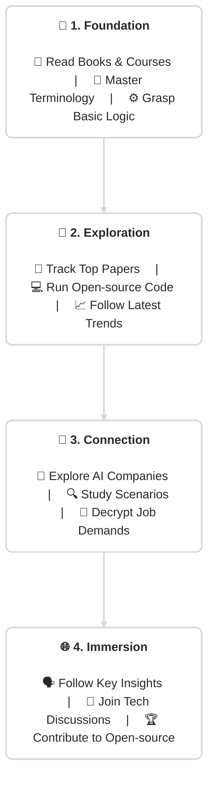

  
  
  
&nbsp;

  
  
  
  
&nbsp;

  
  

    &emsp;
    &emsp;
    
  

  
  
&nbsp;

<h2 align="center"> Our Vision</h2>

<b>Octoday</b> means an extra day — we believe Embodied AI (EAI) will massively boost human productivity, leveraging autonomous technology to truly grant you an extra "eighth day" in your life.

This is not just another tedious paper list. It is a highly curated Hub connecting <b>industry</b>, <b>talent</b>, and <b>knowledge</b>. We bring together a group of idealists driven by open-source ethics. Whether you are an exploring beginner, an algorithm engineer, or an investor, you will find your puzzle piece here.

 

<h2 align="center"> Navigator</h2>

Rejecting endless walls of text, we use <b>intent-driven</b> guidance. Simply find your obstacle below 👇

<table align="center" width="100%">
  <tr>
    <td align="center" width="55%">
      
      <b>Want to build your theoretical foundation?</b>
    </td>
    <td align="center" width="45%">
      
Proceed to: <a target="_blank" href="00-basics.md"><b>📖《Core Basics & Terminology》</b></a>

    </td>
  </tr>
  <tr>
    <td align="center">
      
      <b>Looking for State-Of-The-Art codes & papers?</b>
    </td>
    <td align="center">
      
Proceed to: <a target="_blank" href="03-papers-code.md"><b>📄《Frontier Papers & Repos》</b></a>

    </td>
  </tr>
  <tr>
    <td align="center">
      
      <b>Need reliable Simulation & Testing Tools?</b>
    </td>
    <td align="center">
      
Proceed to: <a target="_blank" href="04-tools.md"><b>🔧《Simulators & Frameworks》</b></a>

    </td>
  </tr>
  <tr>
    <td align="center">
      
      <b>Curious about leading start-ups and products?</b>
    </td>
    <td align="center">
      
Proceed to: <a target="_blank" href="01-companies.md"><b>🏢《EAI Industry Landscape》</b></a>

    </td>
  </tr>
  <tr>
    <td align="center">
      
      <b>Polishing your resume for talent acquisition?</b>
    </td>
    <td align="center">
      
Proceed to: <a target="_blank" href="02-jobs.md"><b>💼《Job Listings & Analytics》</b></a>

    </td>
  </tr>
</table>

 

<h2 align="center"> The Journey (From Zero to Hero)</h2>

Drill down through the Embodied AI ecosystem following the minimal axis:

 

<h2 align="center"> Contribute</h2>

<table align="center" width="100%">
  <tr>
    <td align="center" width="55%">
      
      <b>Have a new startup or paper to submit?</b>
    </td>
    <td align="center" width="45%">
      
Read the: <a target="_blank" href="CONTRIBUTING.md"><b>🤝《Pull Request Guidelines》</b></a>

    </td>
  </tr>
  <tr>
    <td align="center">
      
      <b>Spotted an edge-case bug or broken link?</b>
    </td>
    <td align="center">
      
Launch an: <a target="_blank" href="https://github.com/AlexZhangUPUPUP/octoday-robotics/issues/new/choose"><b>🐛 Issue ticket</b></a>

    </td>
  </tr>
</table>

 

<h2 align="center"> Join the Community</h2>

This hub is entirely unsponsored open-source. Scan the badge below to sync with our latest signals:

  

 

<h2 align="center"> Hall of Fame</h2>

  
Incredible gratitude to the pioneers paving this road:

  

 

  <small>Secured under the highly permissive <a href="LICENSE">MIT License</a>.</small>

