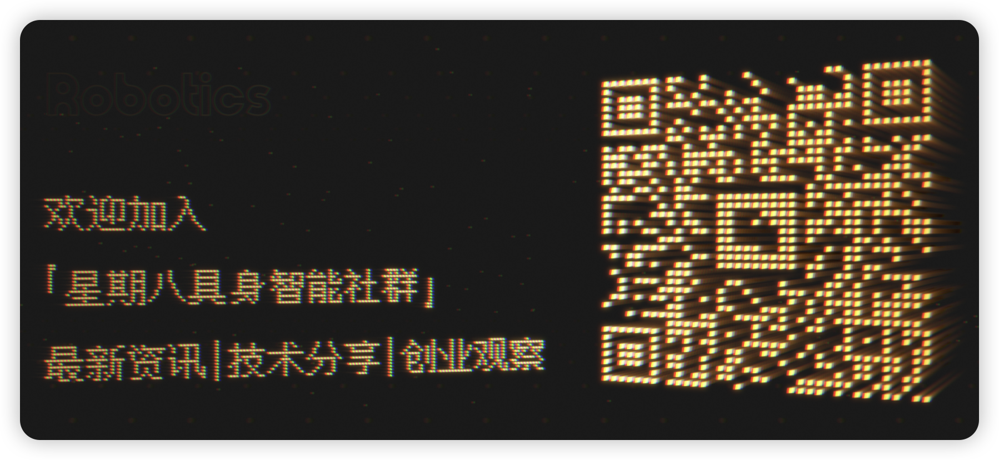

Chinese Version: [README.md](README.md)

# 🤖 Octoday · Embodied AI Open Community

> 🚀 A community homepage connecting industry, capital, students, and talent across Embodied AI
> An open community for learners, researchers, builders, and practitioners across Embodied AI

This is the homepage of Octoday, and an actively updated index of embodied-AI resources, covering fundamentals, frontier papers, open-source codebases, companies, hiring signals, datasets, and weekly observations. You can think of it as both a navigation hub and a collaborative space for people working in embodied AI. Through community curation and clearer information organization, we hope to lower the cost of finding good information, help people build a working map of the field faster, and connect research, engineering, and industry more effectively.

Octoday is not a day on the calendar. It stands for a quieter place outside the usual noise cycle, where long-term, structural value can accumulate. We are not trying to chase every trend. We want to filter real frontier signals, connect academia with industry, and organize ideas, paths, and observations that can actually be used. In *Robinson Crusoe*, Crusoe is no longer alone after rescuing Friday. Here the metaphor takes on a new meaning: Octoday points to a new era of human-machine collaboration, where embodied intelligence is no longer just a tool, but a partner learning to understand the physical world.

This community keeps a seat open for researchers, engineers, and investors who want to think clearly and build patiently. Whether you are deep in a lab, buried in code, or looking for long-term opportunities in the field, you are welcome aboard. This is not a solo journey. It is a shared expedition to define what the future of robotics and human-machine collaboration can become.

## 🪜 Navigation

> If this is your first time visiting the community, the order below is a practical way to browse the repository. It is closer to a usage guide than a fixed learning path.

### 1.1 Browse the fundamentals

Start with [Fundamentals](00-basics.md):

- This section collects the core background material around embodied AI and is a good place to build an initial picture of the field.
- If you are new to embodied AI, it makes sense to scan this section first before moving into papers, companies, and jobs.

### 1.2 Explore papers, code, and datasets

Enter the [Papers and Code Index](03-papers-code.md):

- You can go directly to [Foundation Models](03-papers-code.md#embodied-foundation-models), [VLA](03-papers-code.md#vision-language-action-vla), [Embodied Agents](03-papers-code.md#embodied-agents-reasoning), [Manipulation](03-papers-code.md#manipulation), and [Simulation & Sim2Real](03-papers-code.md#simulation-sim2real) to get a fast sense of the main research directions in embodied AI.
- If you want the bigger picture first, start from [Survey](03-papers-code.md#survey), [Datasets](03-papers-code.md#datasets), and [Benchmarks & Evaluation](03-papers-code.md#benchmarks-evaluation).
- When reading papers, it also helps to look at [Tools and Platforms](04-tools.md) alongside them so the connection between research ideas and engineering practice becomes clearer.

### 1.3 Understand the industry and opportunities

Browse the [Company List](01-companies.md) and [Jobs](02-jobs.md):

- The company section helps you understand the main domestic and global players, their product directions, and the broader shape of the industry.
- The jobs section helps you observe role demand, opportunity distribution, and talent programs, which is often the fastest way to feel how the field is actually moving.

### 1.4 Join the community

If you want to contribute, submit resources, or recommend updates, feel free to reach out:

- **Email**: octoday@yeah.net
- **GitHub Issues**: open an [Issue](https://github.com/AlexZhangUPUPUP/octoday-robotics/issues) in this repository
- **Contact**: scan the QR code below to reach us

---

## ⭐ Star History

If this project is useful to you, consider giving it a Star ⭐

  

## 📄 License

This project is released under the MIT License. See [LICENSE](LICENSE) for details.
