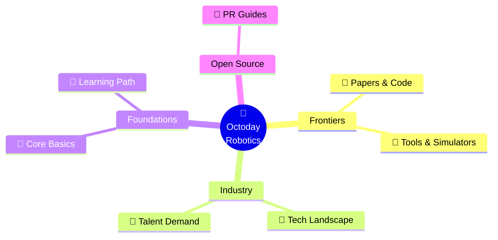

<div align="center">


<br/>

<a href="README.md">
  
</a>

<br/><br/>

# 🤖 Octoday · Embodied Hub
**— Lowering Barriers · Cultivating the Ultimate Embodied AI Map —**

[](https://github.com/AlexZhangUPUPUP/octoday-robotics/stargazers)
[](https://github.com/AlexZhangUPUPUP/octoday-robotics)
[](CONTRIBUTING.md)

</div>

<br/>

## 🗺️ Global Knowledge Map

> 💡 **"Octoday"** signifies an extra day. We curated these structured resources hoping that Embodied AI will liberate human productivity, giving you a true extra "eighth day".  
> This isn't just another tedious paper list—it's a high-energy hub connecting **industry, talent, and knowledge**.



---

## 🎯 Core Terminals

This repository embraces an **On-demand** structural philosophy. Stop scrolling through endless walls of text—use the control deck below to instantly warp to your desired sector.

<div align="center">
  <table>
    <tr>
      <td align="center" width="33%">
        <b>🧠 Foundations</b><br>
        <sub>Theory & Logic</sub><br><br>
        <a href="00-basics.md">
          
        </a><br><br>
        <a href="CONTRIBUTING.md">
          
        </a>
      </td>
      <td align="center" width="33%">
        <b>🏢 Industry</b><br>
        <sub>Scenarios & Startups</sub><br><br>
        <a href="01-companies.md">
          
        </a><br><br>
        <a href="02-jobs.md">
          
        </a>
      </td>
      <td align="center" width="33%">
        <b>🛠️ Ecosystem</b><br>
        <sub>Algorithms & Tools</sub><br><br>
        <a href="03-papers-code.md">
          
        </a><br><br>
        <a href="04-tools.md">
          
        </a>
      </td>
    </tr>
  </table>
</div>
<div align="center">
  <sub>*(Note: The learning community is currently under development. To connect or recommend resources, reach out via Issues!)*</sub>
</div>

---

## 🧭 The Hero Journey (From Zero to Hero)

> Below is a curated path breaking down the Embodied AI ecosystem. A **flowchart for the grand view**, combined with **expandable objective panes** to deliver your actionable tasks.

```mermaid
flowchart LR
    %% Custom Node Styles
    classDef base fill:#E1F5FE,stroke:#0284c7,stroke-width:2px,color:#0369a1,rx:5,ry:5;
    classDef explore fill:#FCE4EC,stroke:#db2777,stroke-width:2px,color:#be185d,rx:5,ry:5;
    classDef connect fill:#FFF8E1,stroke:#d97706,stroke-width:2px,color:#b45309,rx:5,ry:5;
    classDef community fill:#E8F5E9,stroke:#16a34a,stroke-width:2px,color:#15803d,rx:5,ry:5;

    %% Define Nodes with line breaks and text dividers
    A["<b>🧱 1. Foundation</b><br/>━━━━━━━━━━━━━<br/>📖 Read Books & Courses<br/>⚙️ Grasp Basic Logic<br/>🧠 Master Terminology"]:::base
    
    B["<b>🔭 2. Exploration</b><br/>━━━━━━━━━━━━━<br/>📄 Track Top Papers<br/>💻 Run Open-source Code<br/>📈 Follow Latest Trends"]:::explore
    
    C["<b>🧩 3. Connection</b><br/>━━━━━━━━━━━━━<br/>🏢 Explore Companies<br/>🔍 Study Scenarios<br/>💼 Decrypt Job Demands"]:::connect
    
    D["<b>🌐 4. Immersion</b><br/>━━━━━━━━━━━━━<br/>🗣️ Follow Key Insights<br/>💬 Join Tech Discussions<br/>🏆 Contribute to OSS/Comps"]:::community

    %% Flow transitions
    A ====>|"Phase 1"| B
    B ====>|"Phase 2"| C
    C ====>|"Phase 3"| D

    %% Link Styles
    linkStyle default stroke:#94a3b8,stroke-width:2px,color:#475569;
```

### ⚡ Quick Action Checklist
*Click below to expand your next objective!*

<details open>
<summary><b>🔥 Phase 1: Build Foundation</b></summary>
<br>

> 📚 Head straight to [**📖 Basic Knowledge**](00-basics.md):
> 1. Read recommended literature and video courses to build an intuition for robotic architectures.
> 2. Memorize core vocabulary (e.g., VLA, Impedance Control, Forward Kinematics) to conquer paper reading.

</details>

<details>
<summary><b>🔥 Phase 2: Explore Frontiers</b></summary>
<br>

> 🔬 Proceed to [**📄 Papers & Code**](03-papers-code.md) and [**🔧 Tools & Platforms**](04-tools.md):
> 1. Explore fresh SOTA publications from international conferences (CoRL, ICRA).
> 2. Actually run a classic open-source RL/IL repository locally or within Isaac Sim.

</details>

<details>
<summary><b>🔥 Phase 3: Face the Market</b></summary>
<br>

> 🏢 Practical impact is the ultimate goal. Skim through [**🏢 AI Companies**](01-companies.md):
> 1. Analyze what paradigms top startups are adapting into commercial products.
> 2. Compare against [**💼 Job Listings**](02-jobs.md) to deduce skill-gaps and polish your resume.

</details>

<details>
<summary><b>🔥 Phase 4: Open Ecology</b></summary>
<br>

> 🏆 Code is worth a thousand words. Learn how to assist by reading the [**🤝 PR Guides**](CONTRIBUTING.md):
> 1. Track tech-leaders and join hardware/software challenges.
> 2. Give back by submitting a PR to our hub or other open-source projects.

</details>

---

## 🤝 Participation Guidelines

> 💡 **Values thrive in usage, but multiply in sharing.** 
> 
> If this repository saves your time, consider paving the road for the next engineer!

We wholeheartedly welcome all levels of contribution (adding companies, papers, fixing typos, etc.). A few extremely smooth methods:

1. 📖 Browse the [Contribution Guide](CONTRIBUTING.md) for our simple etiquette.
2. ✨ Submit a [Pull Request](https://github.com/AlexZhangUPUPUP/octoday-robotics/compare) to directly inject resources.
3. 🐛 Found a broken block or missing insight? Launch an [Issue](https://github.com/AlexZhangUPUPUP/octoday-robotics/issues/new/choose).

---

## 👥 About Octoday Robotics

**Octoday Robotics** is a borderless commune of Embodied AI enthusiasts, algorithm engineers, and industry researchers. Our architecture aims to systematically compress the immense learning curves in AI robotics.

The project operates under a total open-source ethos. Forward any inquiries, wild ideas, or cooperation requests right our way:

- 📧 **Email**: octoday@yeah.net
- 📝 **Tracker**: [Launch an Issue](https://github.com/AlexZhangUPUPUP/octoday-robotics/issues)
- 📱 **WeChat Platform**: Scan the banner below to join the signal.

<div align="center">
  
</div>

### 🌟 Hall of Fame

Profound thanks to the pioneers laying bricks for this foundation:

<a href="https://github.com/AlexZhangUPUPUP/octoday-robotics/graphs/contributors">
  
</a>

---

## 📄 License

Secured under the highly permissive MIT License. Review [LICENSE](LICENSE) for specifics.
